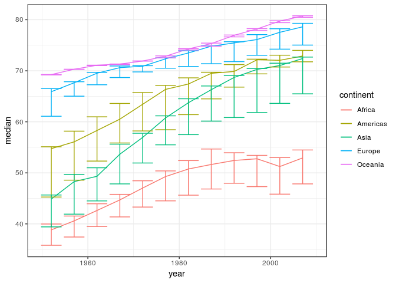
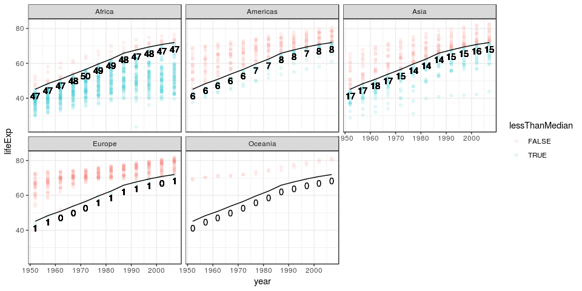
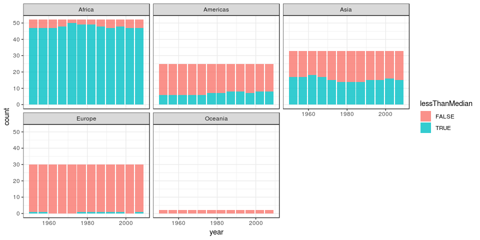
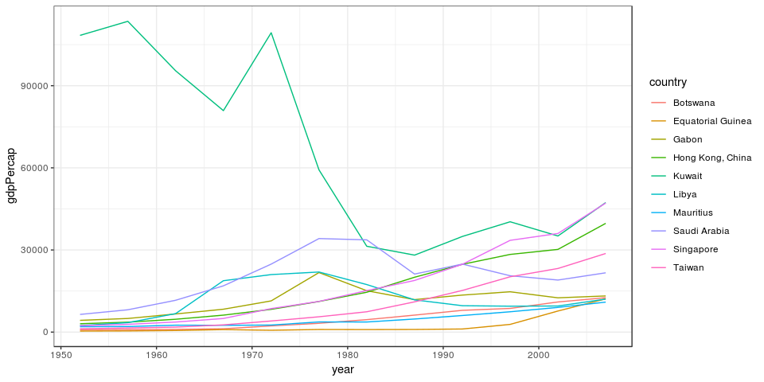

## Introduction

This assignment is intended to provide a deep dive into manipulating data using dplyr and visualizing the results using ggplot2. It is intended to be a more thorough version of assignment 2, demonstrating a practical knowledge of shaping and displaying data.


```
## -- Attaching packages ---------------------------------- tidyverse 1.2.1 --
```

```
## <U+221A> ggplot2 3.0.0     <U+221A> purrr   0.2.5
## <U+221A> tibble  1.4.2     <U+221A> dplyr   0.7.6
## <U+221A> tidyr   0.8.1     <U+221A> stringr 1.3.1
## <U+221A> readr   1.1.1     <U+221A> forcats 0.3.0
```

```
## -- Conflicts ------------------------------------- tidyverse_conflicts() --
## x dplyr::filter() masks stats::filter()
## x dplyr::lag()    masks stats::lag()
```

## Tasks

This section will explore the different tasks according to the parameters of the assignment. This was described in the [assignment](http://stat545.com/Classroom/assignments/hw03/hw03.html) as follows:

> Pick at least three of the tasks below (in the “Task menu” section) and attack each with a table and figure. For each table, make sure to include a relevant figure! Note that:
>
> dplyr should be your data manipulation tool
> ggplot2 should be your visualization tool
> Make observations about what your tables/figures show and about the process.
> 
> Also useful for you to add to your “cheat sheet” are notes on difficulties/oddities. For example, which figures are easy/hard to make, which data formats make better inputs for plotting functions vs. for human-friendly tables.

Each of the following subsections will tackle one task.

### How is life expectancy changing over time on different continents?

This is an interesting intial question. It is an easy approach to analyze the data and suggest future avenues of exploration. The continents will likely be a proxy for other factors, which can be explored once the initial exploration is complete.

First, I will comment on the process used to generate the figures. The inline table/plot was done using a css file posted by Jenny Bryan and authored by Omar AlOmeir at this [gist](https://gist.github.com/jennybc/e9e9aba6ba18c72cec26#file-2015-03-02_plot-next-to-table-rmd). The bars on the line plot are the 25% and 75% quantiles of life expectancy by continent. The table was generated by using the spread function from `tidyr`, which is part of the tidyverse package. I wished to have continents for the rows and years for the columns, to make it easier to read. I used this function, though it is not in `dplyr`, because it provides an elegant way of performing a common task, and thus greatly improves readability. 


```r
lifeExpByContinent = gapminder %>%
  group_by(continent, year) %>%
  summarize(median = median(lifeExp),
            '25%' = quantile(lifeExp, prob = 0.25),
            '75%' = quantile(lifeExp, prob = 0.55))

# I learned how to use select to reshape my data from this article:
# https://datacarpentry.org/R-ecology-lesson/03-dplyr.html#reshaping_with_gather_and_spread
lifeExpByContinentPretty = lifeExpByContinent %>%
  select(continent, year, median) %>%
  spread(key = year, value = median)

lifeExpByContinentTable = lifeExpByContinentPretty %>%
  knitr::kable(digits = 2)
```


```r
lifeExpByContinentPlot = lifeExpByContinent %>%
  ggplot(aes(x = year, group = continent, colour = continent)) +
  geom_line(aes(y = median)) +
  geom_errorbar(aes(ymin = `25%`, ymax = `75%`)) +
  theme_bw()
```

<div class="twoC">

continent     1952    1957    1962    1967    1972    1977    1982    1987    1992    1997    2002    2007
----------  ------  ------  ------  ------  ------  ------  ------  ------  ------  ------  ------  ------
Africa       38.83   40.59   42.63   44.70   47.03   49.27   50.76   51.64   52.43   52.76   51.24   52.93
Americas     54.74   56.07   58.30   60.52   63.44   66.35   67.41   69.50   69.86   72.15   72.05   72.90
Asia         44.87   48.28   49.33   53.66   56.95   60.77   63.74   66.30   68.69   70.27   71.03   72.40
Europe       65.90   67.65   69.53   70.61   70.89   72.34   73.49   74.81   75.45   76.12   77.54   78.61
Oceania      69.25   70.30   71.09   71.31   71.91   72.85   74.29   75.32   76.94   78.19   79.74   80.72

<!-- -->
</div>
<div class="clearer"></div>

A few features can be clearly seen in the above plot. The first is that life expectancy has been rising, with a few exceptions, in every continent or the entire period observed. One of the exceptions is Africa in 2002. The continent with the lowest life expectancy is Africa, and the continent with the highest life expectancy is Oceania. It is not surprising that Oceania has such high life expectancy, as it has only 2 countries, both of which are wealthy. The rise in Africa's life expectancy appears to have levelled off, while the other continents appear to trend upwards. 

The median life expectancies, of each continent maintain their relative order over all of the years, although Asia makes significant gains on the Americas. The continent, from highest to lowest median life expectancy, are Oceania, Europe, Americas, Asia, and Africa.

### Report the absolute and/or relative abundance of countries with low life expectancy over time by continent

This section will explore the number of countries below the median world population by continent over time. The median is being used to avoid being overly affected by outliers in the dataset.

Calculating the median and the life expectancy relative to the median is easy, but not all of the manipulations are trivial. I wanted to keep all of the rows in the initial data frame, so I could make my desired plot. However, I needed to keep one row per continent per year for my desired table. To accomplish this, I used mutate to make `lifeExpGreaterThanAmount` and then filtered to keep the first row in each year per continent for `lifeExpGreaterThanAmountPretty`. I learned how to do this in the following [Stack Overflow Post](https://stackoverflow.com/questions/31528981/select-first-and-last-row-from-grouped-data). Notice that all of the columns I kept for the latter data frame are the same for each year in each continent.

I chose the following plot, as I wished to give a sense of the scale of points below the world median while also displaying the numbers. To this end, I decided to plot the points, coloured by whether they were above the world median by year, labelled with the number of points that are above the line, and facetted by continent.

I also did a stacked bar plot to show the fraction of countries in each continent below the world median life expectancy. I did this to provide an alternative visualization of scale. It is a bit simpler, but provides a reasonable represeantation of scale.


```r
lifeExpGreaterThanAmount = gapminder %>%
  group_by(year) %>%
  mutate(worldMedian = median(lifeExp)) %>%
  group_by(continent, year) %>%
  mutate(lessThanMedian = lifeExp < worldMedian, 
         numberLifeExpectanciesLessThanMedian = sum(lessThanMedian),
         numberOfCountries = n())

# I learned how to use select to reshape my data from this article:
# https://datacarpentry.org/R-ecology-lesson/03-dplyr.html#reshaping_with_gather_and_spread
lifeExpGreaterThanAmountPretty = lifeExpGreaterThanAmount %>%
  select(continent, year, numberLifeExpectanciesLessThanMedian) %>%
  group_by(continent, year) %>%
  filter(row_number() == 1) %>%
  spread(key = year, value = numberLifeExpectanciesLessThanMedian)

lifeExpGreaterThanAmountTable = lifeExpGreaterThanAmountPretty %>%
  knitr::kable()
```


```r
lifeExpGreaterThanAmountPlot = lifeExpGreaterThanAmount %>%
  ggplot(aes(year)) +
  geom_point(aes(y = lifeExp, colour = lessThanMedian), alpha = 0.1) +
  geom_line(aes(y = worldMedian)) +
  geom_text(aes(y = worldMedian, label = numberLifeExpectanciesLessThanMedian), vjust = 1.5) +
  facet_wrap(~continent) +
  theme_bw()

lifeExpGreaterThanAmountBarPlot = lifeExpGreaterThanAmount %>%
  ggplot(aes(year)) +
  geom_bar(aes(fill = lessThanMedian), alpha = 0.8) +
  facet_wrap(~continent) +
  theme_bw()
```


<!-- -->

<div class="twoC">

continent    1952   1957   1962   1967   1972   1977   1982   1987   1992   1997   2002   2007
----------  -----  -----  -----  -----  -----  -----  -----  -----  -----  -----  -----  -----
Africa         47     47     47     48     50     49     49     48     47     48     47     47
Americas        6      6      6      6      6      7      7      8      8      7      8      8
Asia           17     17     18     17     15     14     14     14     15     15     16     15
Europe          1      1      0      0      0      1      1      1      1      1      0      1
Oceania         0      0      0      0      0      0      0      0      0      0      0      0

<!-- -->
</div>
<div class="clearer"></div>

From these results, it is clear that the relative number of countries below the world median life expectancy in a continent is mostly consistent over time. The only significant trend is that there is a small decrease in the number of countries in Asia below the world median life expectancy and a slight increase in the Americas. This is likely due to the narrowing of gap in the median life expectancy between Asia and the Americas that was observed in the previous section.

We can also see that African countries are mostly below the world median life expectancy. Asian countries are more evenly distributed on either side of the median. The Americas are mostly, but not entirely, above the median. Finally, Europe and Oceania are almost entirely above the median.

### Find countries with interesting stories

For this section, I will need to find countries with interesting stories. I think that interesting stories tend to have the most volatility, so I will be looking at countries with the greatest amount of volatility in gdp per capita. It is hard to get a sense of the volatility with such low resolution data in the presence of trends. To control the effect of overall regional growth, I will normalize the results by continent.


```r
# This is a bit complex, but I first calculate the gdpPerCap by region each year, normalize each country.
# I then calculate the variance of the gdpPerCap for each country over time, and then filter to get
# the ten countries with the highest variance of gdpPercap.
volatileGdpPerCapita = gapminder %>%
  group_by(year, continent) %>%
  mutate(regionalMedGPC = median(gdpPercap),
         normGPC = gdpPercap / regionalMedGPC,) %>%
  group_by(continent, country) %>%
  mutate(varNormGPC = var(normGPC)) %>%
  ungroup() %>%
  arrange(varNormGPC) %>%
  top_n(10 * length(unique(gapminder$year)))
```

```
## Selecting by varNormGPC
```

```r
# I learned how to use select to reshape my data from this article:
# https://datacarpentry.org/R-ecology-lesson/03-dplyr.html#reshaping_with_gather_and_spread
volatileGdpPerCapitaPretty = volatileGdpPerCapita %>%
  select(country, year, gdpPercap) %>%
  spread(key = year, value = gdpPercap)

volatileGdpPerCapitaTable = volatileGdpPerCapitaPretty %>%
  knitr::kable(digits = 2)
```


```r
volatileGdpPerCapitaPlot = volatileGdpPerCapita %>%
  ggplot(aes(x = year, y = gdpPercap)) +
  geom_line(aes(group = country, colour = country)) +
  theme_bw()
```

<div class="twoC">

country                   1952        1957       1962       1967        1972       1977       1982       1987       1992       1997       2002       2007
------------------  ----------  ----------  ---------  ---------  ----------  ---------  ---------  ---------  ---------  ---------  ---------  ---------
Botswana                851.24      918.23     983.65    1214.71     2263.61    3214.86    4551.14    6205.88    7954.11    8647.14   11003.61   12569.85
Equatorial Guinea       375.64      426.10     582.84     915.60      672.41     958.57     927.83     966.90    1132.06    2814.48    7703.50   12154.09
Gabon                  4293.48     4976.20    6631.46    8358.76    11401.95   21745.57   15113.36   11864.41   13522.16   14722.84   12521.71   13206.48
Hong Kong, China       3054.42     3629.08    4692.65    6197.96     8315.93   11186.14   14560.53   20038.47   24757.60   28377.63   30209.02   39724.98
Kuwait               108382.35   113523.13   95458.11   80894.88   109347.87   59265.48   31354.04   28118.43   34932.92   40300.62   35110.11   47306.99
Libya                  2387.55     3448.28    6757.03   18772.75    21011.50   21951.21   17364.28   11770.59    9640.14    9467.45    9534.68   12057.50
Mauritius              1967.96     2034.04    2529.07    2475.39     2575.48    3710.98    3688.04    4783.59    6058.25    7425.71    9021.82   10956.99
Saudi Arabia           6459.55     8157.59   11626.42   16903.05    24837.43   34167.76   33693.18   21198.26   24841.62   20586.69   19014.54   21654.83
Singapore              2315.14     2843.10    3674.74    4977.42     8597.76   11210.09   15169.16   18861.53   24769.89   33519.48   36023.11   47143.18
Taiwan                 1206.95     1507.86    1822.88    2643.86     4062.52    5596.52    7426.35   11054.56   15215.66   20206.82   23235.42   28718.28

<!-- -->
</div>
<div class="clearer"></div>

There are several interesting stories in this data, especially considering that these are the ten countries with the greatest variance in gdpPerCapita relative to the continent means. The most obvious interesting story is Kuwait, which swings between high GPC's (GDP per capita) until the 1970's before dropping from 1.0838235\times 10^{5} to 2.811843\times 10^{4}, before beginning to gradually rise. This is likely due to the fact that Kuwait's wealth derives from oil reserves, which depend upon international oil prices. I believe this is especially interesting given that the fall occurred before the Gulf War, in which Kuwait was invaded by Iraq.

There are several countries that had success followed by a decline, such as Libya, Saudi Arabia, and Gabon. The first two of these also have economies that largely depend on oil. The last, Gabon, simply had an unfortunately stagnant economy.

Thankfully, there are many more countries that are success stories. Their variance will have been inflated by the fact that their economies were not volatile, but rather grown much faster than the rest of the region. Some examples of this are Hong Kong, Mauritius, and Taiwan. Though I never intended to include countries with uniform success, I believe that they are still interesting due to their degree of success. It is also nice to see some success amongst the tumult of the other, more volatile, economies.
