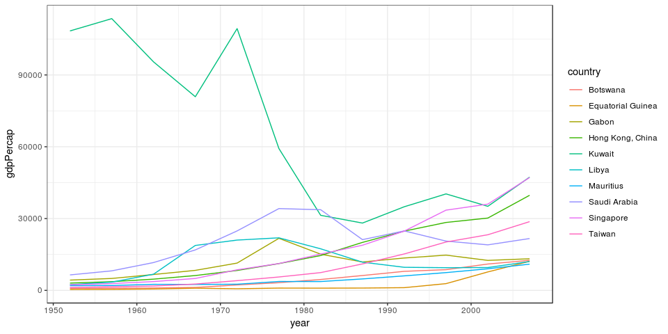

STAT 545A - Homework 3: Use dplyr/ggplot2 to manipulate and explore data
================
Glenn McGuinness

-   [Introduction](#introduction)
-   [Tasks](#tasks)

Introduction
------------

This assignment is intended to provide a deep dive into manipulating data using dplyr and visualizing the results using ggplot2. It is intended to be a more thorough version of assignment 2, demonstrating a practical knowledge of shaping and displaying data.

    ## -- Attaching packages ---------------------------------- tidyverse 1.2.1 --

    ## <U+221A> ggplot2 3.0.0     <U+221A> purrr   0.2.5
    ## <U+221A> tibble  1.4.2     <U+221A> dplyr   0.7.6
    ## <U+221A> tidyr   0.8.1     <U+221A> stringr 1.3.1
    ## <U+221A> readr   1.1.1     <U+221A> forcats 0.3.0

    ## -- Conflicts ------------------------------------- tidyverse_conflicts() --
    ## x dplyr::filter() masks stats::filter()
    ## x dplyr::lag()    masks stats::lag()

Tasks
-----

This section will explore the different tasks according to the parameters of the assignment. This was described in the [assignment](http://stat545.com/Classroom/assignments/hw03/hw03.html) as follows:

> Pick at least three of the tasks below (in the “Task menu” section) and attack each with a table and figure. For each table, make sure to include a relevant figure! Note that:
>
> dplyr should be your data manipulation tool ggplot2 should be your visualization tool Make observations about what your tables/figures show and about the process.
>
> Also useful for you to add to your “cheat sheet” are notes on difficulties/oddities. For example, which figures are easy/hard to make, which data formats make better inputs for plotting functions vs. for human-friendly tables.

Each of the following subsections will tackle one task.

``` r
library(ggplot2)
suppressMessages(library(dplyr))
#devtools::install_github("jennybc/gapminder")
library("gapminder")
gtbl <- tbl_df(gapminder)
```

    ## `summarise_each()` is deprecated.
    ## Use `summarise_all()`, `summarise_at()` or `summarise_if()` instead.
    ## To map `funs` over a selection of variables, use `summarise_at()`

| continent |       mean|     median|
|:----------|----------:|----------:|
| Africa    |   2193.755|   1192.138|
| Americas  |   7136.110|   5465.510|
| Asia      |   7902.150|   2646.787|
| Europe    |  14469.476|  12081.749|
| Oceania   |  18621.609|  17983.304|


